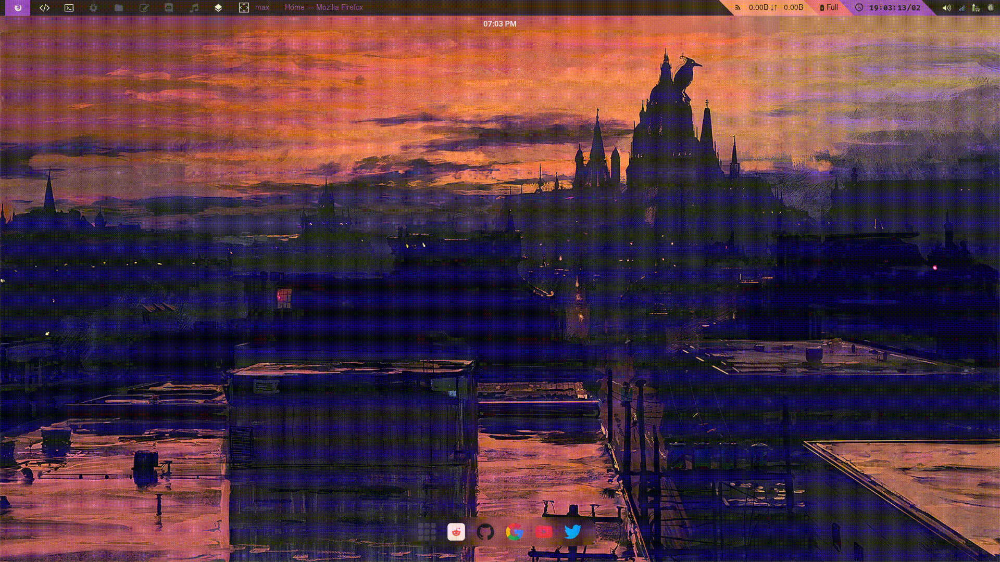

## A minimal startpage

This startpage focusses on minimalism and functionality.

## Screenshots

| Web Menu                           | Icon Hover                           |
| ---                                | ---                                  |
|  |  |

## Configuration
 
### - This startpage has the following dependencies

Which ever wallpaper setter you want to use.
* [Nitrogen](https://github.com/l3ib/nitrogen), [feh](https://github.com/derf/feh), or [pywal](https://github.com/dylanaraps/pywal).

If you want this to change background dynamically.

* [Browser-Sync](https://browsersync.io/). 
  
If you want this on the newtab page (Firefox).
 
* [New Tab Homepage](https://addons.mozilla.org/en-US/firefox/addon/new-tab-homepage/) 

You can add or remove dock or web menu websites in the config.js file.

Add the changeWallpaper file to path and prefereably bind the script to a key. 

Also add the startpage.sh to your autostart script.
  
Best used with this [minimal firefox
CSS](https://github.com/noib3/dotfiles/tree/macOS/firefox) or minimal browsers
like surf or qutebrowser or luakit.

!!This is a fork of [manilarome's glorious-startpage](https://github.com/manilarome/the-glorious-startpage)

I have debloated it and tried to make it minimal
